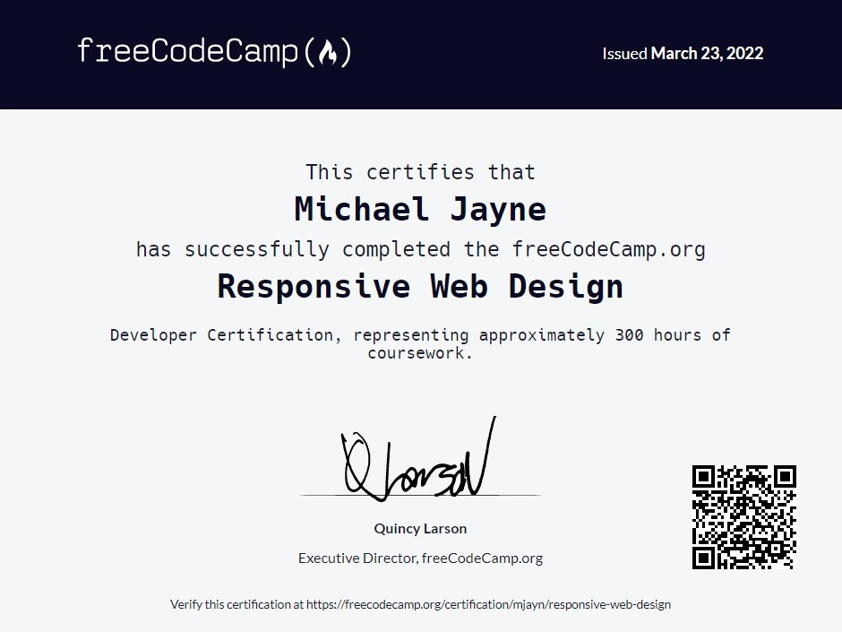
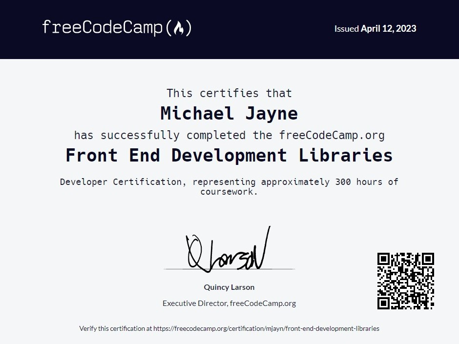
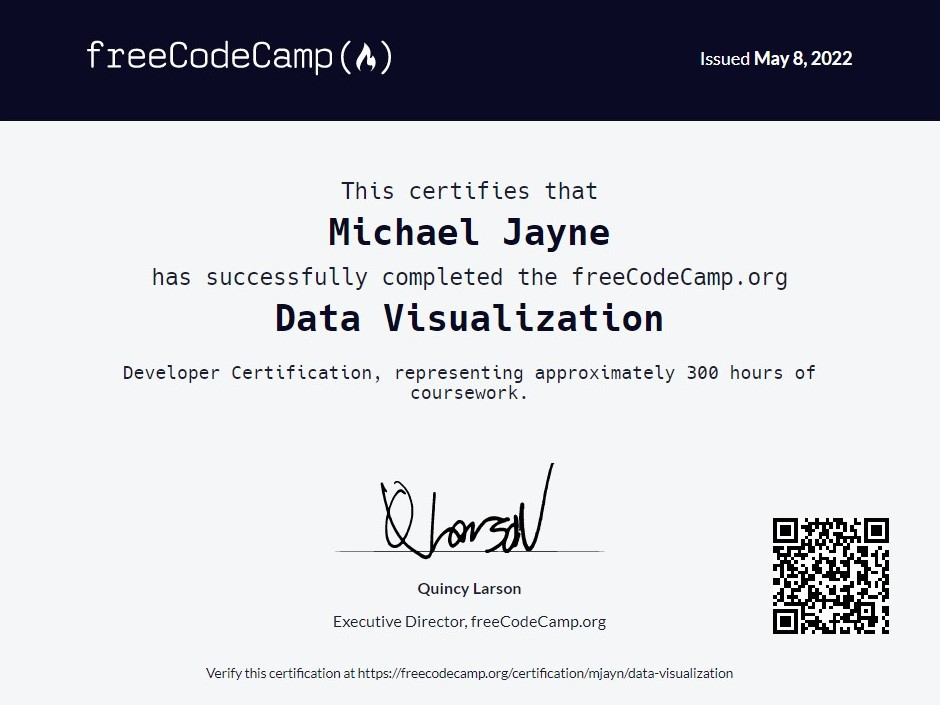
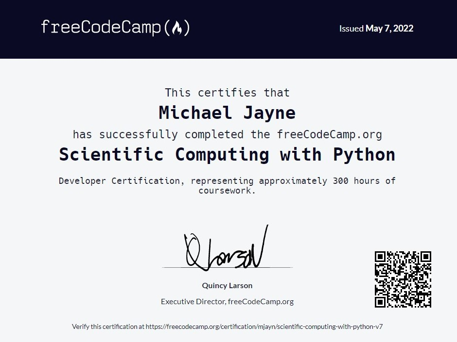
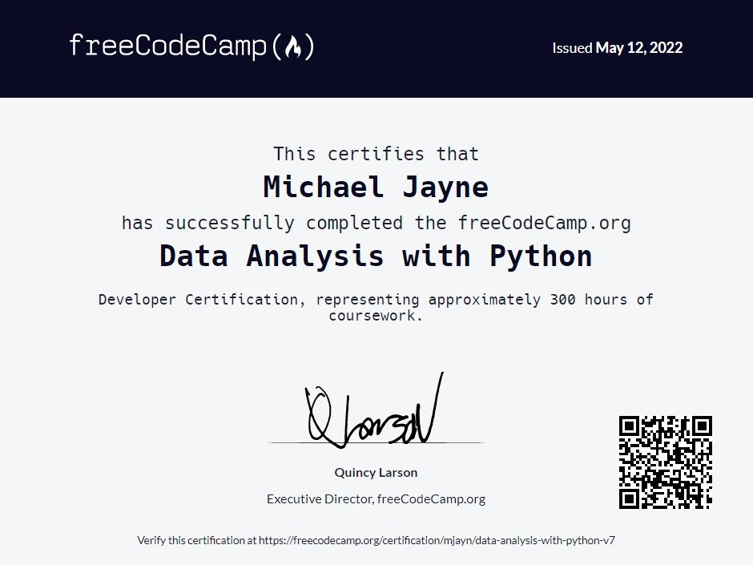

# FreeCodeCamp Certifications

## Table of Contents

- [Responsive Web Design](#responsive-web-design)
- [Front End Development Libraries](#front-end-development-libraries)
- [Data Visualization](#data-visualization)
- [Scientific Computing with Python](#scientific-computing-with-python)
- [Data Analysis with Python](#data-analysis-with-python)
- [Machine Learning with Python](#machine-learning-with-python)

## Responsive Web Design

Project Name | Solution
:-- | :--:
[Build a Survey Form](https://www.freecodecamp.org/learn/2022/responsive-web-design/build-a-survey-form-project/build-a-survey-form) | 
[Build a Tribute Page](https://www.freecodecamp.org/learn/2022/responsive-web-design/build-a-tribute-page-project/build-a-tribute-page) | 
[Build a Technical Documentation Page](https://www.freecodecamp.org/learn/2022/responsive-web-design/build-a-technical-documentation-page-project/build-a-technical-documentation-page) | 
[Build a Product Landing Page](https://www.freecodecamp.org/learn/2022/responsive-web-design/build-a-product-landing-page-project/build-a-product-landing-page) | 
[Build a Personal Portfolio Webpage](https://www.freecodecamp.org/learn/2022/responsive-web-design/build-a-personal-portfolio-webpage-project/build-a-personal-portfolio-webpage) | 

## Front End Development Libraries

Project Name | Solution
:-- | :--:
[Build a Random Quote Machine](https://www.freecodecamp.org/learn/front-end-development-libraries/front-end-development-libraries-projects/build-a-random-quote-machine) | 
[Build a Markdown Previewer](https://www.freecodecamp.org/learn/front-end-development-libraries/front-end-development-libraries-projects/build-a-markdown-previewer) | 
[Build a Drum Machine](https://www.freecodecamp.org/learn/front-end-development-libraries/front-end-development-libraries-projects/build-a-drum-machine) | 
[Build a JavaScript Calculator](https://www.freecodecamp.org/learn/front-end-development-libraries/front-end-development-libraries-projects/build-a-javascript-calculator) | 
[Build a 25 + 5 Clock](https://www.freecodecamp.org/learn/front-end-development-libraries/front-end-development-libraries-projects/build-a-25--5-clock) | 

## Data Visualization

Project Name | Solution
:-- | :--:
[Visualize Data with a Bar Chart](https://www.freecodecamp.org/learn/data-visualization/data-visualization-projects/visualize-data-with-a-bar-chart) | 
[Visualize Data with a Scatterplot Graph](https://www.freecodecamp.org/learn/data-visualization/data-visualization-projects/visualize-data-with-a-scatterplot-graph) |
[Visualize Data with a Heat Map](https://www.freecodecamp.org/learn/data-visualization/data-visualization-projects/visualize-data-with-a-heat-map) | 
[Visualize Data with a Choloropleth Map](https://www.freecodecamp.org/learn/data-visualization/data-visualization-projects/visualize-data-with-a-choropleth-map) | 
[Visualize Data with a Treemap Diagram](https://www.freecodecamp.org/learn/data-visualization/data-visualization-projects/visualize-data-with-a-treemap-diagram) | 

## Scientific Computing with Python

Project Name | Solution
:-- | :--:
[Arithmetic Formatter](https://www.freecodecamp.org/learn/scientific-computing-with-python/build-an-arithmetic-formatter-project/build-an-arithmetic-formatter-project) | 
[Time Calculator](https://www.freecodecamp.org/learn/scientific-computing-with-python/build-a-time-calculator-project/build-a-time-calculator-project) |
[Budget App](https://www.freecodecamp.org/learn/scientific-computing-with-python/build-a-budget-app-project/build-a-budget-app-project) | 
[Polygon Area Calculator](https://www.freecodecamp.org/learn/scientific-computing-with-python/build-a-polygon-area-calculator-project/build-a-polygon-area-calculator-project) | 
[Probability Calculator](https://www.freecodecamp.org/learn/scientific-computing-with-python/build-a-probability-calculator-project/build-a-probability-calculator-project) | 

## Data Analysis with Python

Project Name | Solution
:-- | :--:
[Mean-Variance-Standard Deviation Calculator](https://www.freecodecamp.org/learn/data-analysis-with-python/data-analysis-with-python-projects/mean-variance-standard-deviation-calculator) | 
[Demographic Data Analyzer](https://www.freecodecamp.org/learn/data-analysis-with-python/data-analysis-with-python-projects/demographic-data-analyzer) | 
[Medical Data Visualizer](https://www.freecodecamp.org/learn/data-analysis-with-python/data-analysis-with-python-projects/medical-data-visualizer) | 
[Page View Time Series Visualizer](https://www.freecodecamp.org/learn/data-analysis-with-python/data-analysis-with-python-projects/page-view-time-series-visualizer) | 
[Sea Level Predictor](https://www.freecodecamp.org/learn/data-analysis-with-python/data-analysis-with-python-projects/sea-level-predictor) | 

## Machine Learning with Python

Project Name | Solution
:-- | :--:
[Rock Paper Scissors](https://www.freecodecamp.org/learn/machine-learning-with-python/machine-learning-with-python-projects/rock-paper-scissors) | 
[Cat and Dog Image Classifier](https://www.freecodecamp.org/learn/machine-learning-with-python/machine-learning-with-python-projects/cat-and-dog-image-classifier) | 
[Book Recomendation Engine using KNN](https://www.freecodecamp.org/learn/machine-learning-with-python/machine-learning-with-python-projects/book-recommendation-engine-using-knn) | 
[Linear Regression Health Costs Calculator](https://www.freecodecamp.org/learn/machine-learning-with-python/machine-learning-with-python-projects/linear-regression-health-costs-calculator) |
[Neural Network SMS Text Classifier](https://www.freecodecamp.org/learn/machine-learning-with-python/machine-learning-with-python-projects/neural-network-sms-text-classifier) | 

## Back End Development and APIs

⚠️ **In Progress** ⚠️

Project Name | Solution
:-- | :--:
[Timestamp Microservice](https://www.freecodecamp.org/learn/apis-and-microservices/apis-and-microservices-projects/timestamp-microservice) | 
[Request Header Parser Microservice](https://www.freecodecamp.org/learn/apis-and-microservices/apis-and-microservices-projects/request-header-parser-microservice) | 
[URL Shortener Microservice](https://www.freecodecamp.org/learn/apis-and-microservices/apis-and-microservices-projects/url-shortener-microservice) | 
[Exercise Tracker Microservice](https://www.freecodecamp.org/learn/back-end-development-and-apis/back-end-development-and-apis-projects/exercise-tracker) | 
[File Metadata Microservice](https://www.freecodecamp.org/learn/apis-and-microservices/apis-and-microservices-projects/file-metadata-microservice) | 
